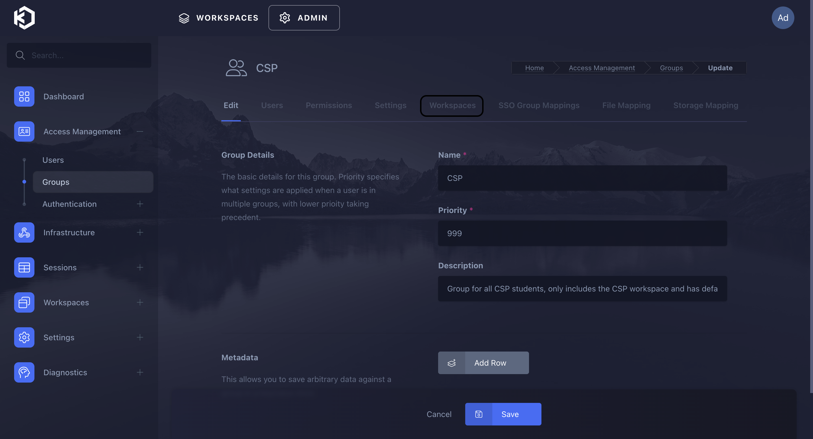
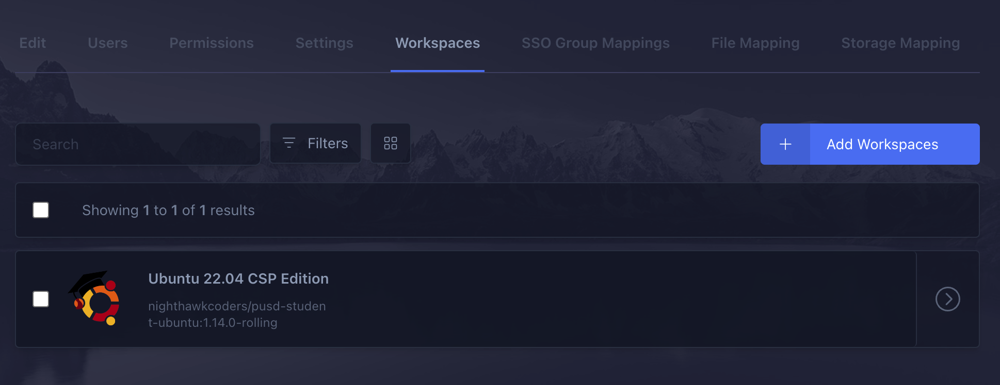

# KASM User Update Documentation

## Overview

This documentation provides a detailed guide on how to update a user in KASM using the KASM API. It covers the API endpoint, the required data structure, and the process to follow. Additionally, it highlights the password requirements enforced by KASM.

## API Endpoint

To update a user in KASM, use the following endpoint:

```
POST /api/public/update_user
```

### Request Structure

The request to update a user should include the following JSON payload:

```json
{
  "api_key": "YOUR_API_KEY",
  "api_key_secret": "YOUR_API_KEY_SECRET",
  "target_user": {
    "user_id": "USER_ID",
    "username": "NEW_USERNAME",
    "first_name": "NEW_FIRST_NAME",
    "last_name": "NEW_LAST_NAME",
    "locked": false,
    "disabled": false,
    "organization": "NEW_ORGANIZATION",
    "phone": "123-456-7890",
    "password": "NEW_PASSWORD"
  }
}
```

- **api_key**: Your KASM API key.
- **api_key_secret**: The secret associated with your KASM API key.
- **user_id**: The unique identifier of the user to update.
- **username**: (Optional) The new username for the user.
- **first_name**: (Optional) The new first name of the user.
- **last_name**: (Optional) The new last name of the user.
- **locked**: (Optional) Boolean value indicating whether the user's account is locked.
- **disabled**: (Optional) Boolean value indicating whether the user's account is disabled.
- **organization**: (Optional) The new organization or group to which the user belongs.
- **phone**: (Optional) The phone number of the user.
- **password**: (Optional) The new password for the user.

### Password Requirements

KASM enforces strong password requirements to ensure user account security. The password must meet the following criteria:

- At least 8 characters long
- Includes at least one uppercase letter
- Includes at least one lowercase letter
- Includes at least one number
- Includes at least one special character (e.g., !, @, #, $, etc.)

### Example Request

Here is an example of an update request:

```json
{
  "api_key": "example_api_key",
  "api_key_secret": "example_api_key_secret",
  "target_user": {
    "user_id": "1234",
    "username": "new_username",
    "first_name": "New",
    "last_name": "User",
    "locked": false,
    "disabled": false,
    "organization": "New Organization",
    "phone": "123-456-7890",
    "password": "NewP@ssw0rd"
  }
}
```

### Response

A successful request will return a 200 status code along with the updated user details in the response body. If the request fails, the API will return an error message and a corresponding status code.

## Error Handling

If the user update fails, the KASM API will return an error message. Common reasons for failure include:

- **Invalid API credentials**: Ensure that the `api_key` and `api_key_secret` are correct.
- **User not found**: The `user_id` provided does not match any existing users.
- **Password does not meet requirements**: Ensure that the new password complies with KASM's security policies.


# Kasm Utilities Documentation

This documentation covers a Python script designed to interact with the Kasm API for managing users. The script provides various utilities to authenticate, create, update, and delete Kasm users. It also allows for group management within the Kasm environment.

## Overview

The script consists of two main classes:

- **KasmUtils**: Contains static methods to perform various Kasm API operations such as authentication, user retrieval, user creation, user deletion, and user updates.
- **KasmUser & UpdateUser**: These classes provide higher-level interfaces for creating, updating, and deleting users by utilizing the methods from KasmUtils.

### KasmUtils Class

1. **get_config()**
    - Purpose: Retrieves the Kasm server URL, API key, and API key secret from the application configuration.
    - Returns: A tuple (SERVER, API_KEY, API_KEY_SECRET) or an error message if any of the keys are missing.

2. **authenticate(config)**
    - Purpose: Authenticates the provided Kasm API keys against the Kasm server.
    - Parameters: config (tuple): A tuple containing the Kasm server URL, API key, and API key secret.
    - Returns: The response from the server or an error message if authentication fails.

3. **get_user_id(users, uid)**
    - Purpose: Finds the Kasm user_id corresponding to a given uid from a list of users.
    - Parameters: users (list): List of users fetched from the Kasm server, uid (str): The user ID to find.
    - Returns: The user_id if found, or None if not found.

4. **get_users(config)**
    - Purpose: Retrieves all users from the Kasm server.
    - Parameters: config (tuple): The Kasm server URL, API key, and API key secret.
    - Returns: A list of users or an error message if the retrieval fails.

5. **create_user(config, uid, first_name, last_name, password)**
    - Purpose: Creates a new user on the Kasm server.
    - Parameters: config (tuple): The Kasm server URL, API key, and API key secret, uid (str): The user ID, first_name (str): First name, last_name (str): Last name, password (str): User password.
    - Returns: The server response or an error message if user creation fails.

6. **delete_user(config, user_id)**
    - Purpose: Deletes an existing user on the Kasm server.
    - Parameters: config (tuple): The Kasm server URL, API key, and API key secret, user_id (str): The ID of the user to delete.
    - Returns: The server response or an error message if user deletion fails.

7. **update_ug_logic(config, uid, username, first_name, last_name, password, group)**
    - Purpose: Updates an existing user's information on the Kasm server.
    - Parameters: config (tuple): The Kasm server URL, API key, and API key secret, uid (str): The user ID, username (str): Username, first_name (str): First name, last_name (str): Last name, password (str): User password, group (str): User group.
    - Returns: The server response or an error message if the update fails.

### KasmUser Class

1. **post(name, uid, password)**
    - Purpose: Interface to create a new Kasm user.
    - Parameters: name (str): Full name of the user, uid (str): The user ID, password (str): The user's password.
    - Returns: Outputs the server response or an error message if user creation fails.

2. **delete(uid)**
    - Purpose: Interface to delete an existing Kasm user.
    - Parameters: uid (str): The user ID to delete.
    - Returns: Outputs the server response or an error message if user deletion fails.

### UpdateUser Class

1. **group_change(uid, old_group, new_group)**
    - Purpose: Interface to change a user's group in the Kasm environment.
    - Parameters: uid (str): The user ID to update, old_group (str): The current group, new_group (str): The new group to assign.
    - Returns: Outputs the server response or an error message if the group change fails.

## Kasm Groups and Workspaces

Kasm groups allow you to limit users to specific workspaces, providing a way to control access based on user roles or departments. To assign specific workspaces to a group, follow these steps:

1. **Create a Group**: Navigate to the Kasm administration panel and create a new group.
2. **Assign Workspaces**: In the group settings, locate the "Allowed Workspaces" section.
3. **Select Workspaces**: Choose the specific workspace(s) you want to allow the group members to access.
4. **Save Settings**: Apply the settings to limit the group to the selected workspaces.




To understand how Kasm reads workspaces from different registries, you can see which workspaces are available in the [Nighthawk Coders Kasm Registry](https://nighthawkcoders.github.io/kasm_registry/1.0/). This is the access point for Kasm to pull files from Docker Hub, enabling Kasm to add workspaces through different registries, as explained in the [Kasm Workspace Registry Guide](https://kasmweb.com/docs/latest/guide/workspace_registry.html).

For more detailed information on Kasm API methods, including user updates, refer to the [Kasm Developer API Documentation](https://kasmweb.com/docs/latest/api/developer_api.html#update-user).


## Kasm Workspaces Overview
This Kasm workspaces project is intended to produce Desktop software and Development tools to meet the student's needs.  Kasm workspaces are dependent on AWS EC2 servers that are installed with Kasm workspaces "server"; that project is in another folder in this repository.
```
Kasm workspace software development workflow (-> action, * dependency)
---------------------------------------------------------------------

Development                Deployment                Test (on Kasm server)
|-----------------------|   |----------------------|  |-----------------------|
| -> Code Docker Image  |   | -> Publish Images    |  | -> Install Image      |
|    Recipes            |   |   with tag           |  |    from Registry      |
|   * GitHub            |   |   * DockerHub        |  | -> Start Workspace    |
|      Code Repo        |   |      Images Repo     |  |    Session            |
|                       |   |   * GitHub           |  | -> Test Desktop       |
|                       |   |      Registry Repo   |  |    Features           |
|-----------------------|   |----------------------|  |-----------------------|

Software Development Life Cycle (SDLC)
--------------------------------------
Code -> Build Images (w/tag) -> Push tag -> Test Images
```


## Kasm Workspaces SDLC
The Developer iterates through the actions that follow.  Be aware to look ahead as time of jobs, size of images, and tags of images can cause frustrations and challenges.

1. `Code` in dockerfile-* and in src directory
    - add code for new tools
    - add support files to src/ubuntu/install, check [Kasm](https://github.com/kasmtech/workspaces-images.git)

2. `Build` the dockerfile-* file
Commands

```bash
# clean up docker often, before a new run is best
docker image prune
# tag name needs to match your docker hub setup, see below, latest could be :1.0 for specific verion
docker build -t nighthawkcoders/kasm_workspaces:latest -f dockerfile-csse-nighthawk-ubuntu-jammy-desktop .
````

Logging

```bash
# This can take a long time "20 minutes", see time!!!
[+] Building 872.6s (15/15) FINISHED
 => [internal] load build definition from dockerfile-csse-nighthawk-ubuntu-jammy-desktop-agupta            0.0s
 => => transferring dockerfile: 2.11kB                                                                     0.0s
 => [internal] load .dockerignore                                                                          0.0s
 => => transferring context: 2B                                                                            0.0s
 => [internal] load metadata for docker.io/kasmweb/core-ubuntu-focal:1.13.1                                2.6s
 => [ 1/10] FROM docker.io/kasmweb/core-ubuntu-focal:1.13.1@sha256:5c2f1bbe9bcc679ddcdf73e21f8ce9d4214cfb  0.0s
 => [internal] load build context                                                                          0.0s
 => => transferring context: 15.66kB                                                                       0.0s
 => CACHED [ 2/10] WORKDIR /home/kasm-default-profile                                                      0.0s
 => CACHED [ 3/10] COPY ./src/ubuntu/install /dockerstartup/install                                        0.0s
 => CACHED [ 4/10] RUN   for SCRIPT in tools/install_tools.sh                   chrome/install_chrome.sh   0.0s
 => [ 5/10] RUN cd /tmp/ &&     wget https://repo.anaconda.com/archive/Anaconda3-2023.07-1-Linux-x86_64  123.9s
 => [ 6/10] RUN echo 'export PATH="/opt/anaconda3/bin:$PATH"' >> /etc/bash.bashrc &&     /opt/anaconda3  573.9s
 => [ 7/10] RUN chown 1000:0 /home/kasm-default-profile                                                    0.3s
 => [ 8/10] RUN /dockerstartup/set_user_permission.sh /home/kasm-default-profile                           1.2s
 => [ 9/10] WORKDIR /home/kasm-user                                                                        0.0s
 => [10/10] RUN mkdir -p /home/kasm-user && chown -R 1000:0 /home/kasm-user                                0.2s
 => exporting to image                                                                                   170.3s
 => => exporting layers                                                                                  170.2s
 => => writing image sha256:d9c1fd0c858f8d6e43eea6d4ce52540e718374da85e8774c05bd2d6f334d374c               0.0s
 => => naming to docker.io/devops/csse-kasm-workspaces:1.0
```
3. `Push` the docker files
Commands

```bash
# Setup your dockerhub by registering account through docker.io.  This is like GitHub, the public repositories are free.
docker login
# if you name is wrong, you can rename it to match: docker tag devops/csse-kasm-workspaces:latest:1.0 nighthawkcoders/kasm_workspaces:latest
# Tag names need to match the [docker hub](https://hub.docker.com/repository/docker/nighthawkcoders/kasm_workspaces/general).
docker push nighthawkcoders/kasm_workspaces:latest
```

Logging

```bash
# This can take a long time "hours", but seems to recover from interupts, see log
# Note, screen saver causes job to pause
The push refers to repository [docker.io/nighthawkcoders/kasm_workspaces]
2a1c121ffe10: Preparing
5f70bf18a086: Preparing
ba97dcb9b48e: Preparing
43829d907bf5: Preparing
c2c23b83a67b: Preparing
7394376fd8c2: Waiting
7f71d15b5062: Waiting
8d1ff2660c79: Waiting
d31550a9bd79: Waiting
faf9ed65e452: Waiting
f0e68679b4a0: Waiting
ede4c8fd2a48: Waiting
52bc49669665: Waiting
3ce2f9513d62: Waiting
53c6646e1b86: Waiting
7bb99a4e8d1e: Waiting
980b09195535: Waiting
eaaf9137396d: Waiting
3b294c4eb0b9: Waiting
5cfbbec7fee9: Waiting
7b62ef8b6184: Waiting
d31550a9bd79: Pushing [===============>                                   ]  1.959GB/6.42GB
cf1de89ac5da: Layer already exists
1aed7b7359c3: Layer already exists
91f32011820e: Layer already exists
d9fb259c210b: Layer already exists
f7e680995ade: Layer already exists
0c14e6ac6cf1: Layer already exists
22bef8b22033: Layer already exists
5b8ca191b60b: Layer already exists
2aed46e7ee11: Layer already exists
3f0976fe4ecf: Layer already exists
6eb744c503e9: Layer already exists

```

4. `Test` on Kasm
- [Registry setup](https://github.com/nighthawkcoders/kasm_registry/tree/1.0/workspaces/CSSE-Ubuntu-Jammy)
- Goto Kasm Sever (aka kasm100.nighthawkcodingsociety.com), login admin@kasm.local.   Select from the left panel "Workspace", then "Workspace Registry".  "Add new" registry if "Del Norte HS Computer Science" is not found. Obtain the Registry Link [here](https://nighthawkcoders.github.io/kasm_registry).
- Click on small icons and install "Available Workspace".  This can take some time!!!
- At the top of the screen select "WORKSPACES" and then install workspace from the registry () is required for the pushed image to be visible on the Kasm workspaces admin panel
- run workplace

## Registry Data
The registry has an instance of the DevOps kasm_workspaces.
- GitHub Pages Location: [kasm_registry GitHub Pages](https://nighthawkcoders.github.io/kasm_registry/1.0/)  On the server you can view attributes for a workspace in a friendly form.
- GitHub location: [kasm_registry files](https://github.com/nighthawkcoders/kasm_registry)  The easier way to make a new registry entry, for me, is to copy a folder in Workspaces and adjust entries for your specific branding.

```json
{
    "description": "Nighthawk Coders CSSE Official 2023-2024 Ubuntu Desktop Workspace",
    "docker_registry": "https://index.docker.io/v1/",
    "image_src": "nighthawkcoders.png",
    "name": "nighthawkcoders/kasm_workspaces:latest",
    "run_config": {
      "hostname": "kasm"
    },
    "exec_config": {
        "go": {
          "cmd": "bash -c '/dockerstartup/custom_startup.sh --go --url \"$KASM_URL\"'"
        },
        "assign": {
          "cmd": "bash -c '/dockerstartup/custom_startup.sh --assign --url \"$KASM_URL\"'"
        }
    },
    "categories": [
      "Desktop",
      "Development"
    ],
    "friendly_name": "CSSE Ubuntu Jammy",
    "architecture": [
      "amd64"
    ],
    "compatibility": [
      "1.13.x"
    ],
    "uncompressed_size_mb": 10000
  }
```

## Kasm Administration
Manual configuration is required for the following.

### Workspace Server Configs
Each time you perform a Terraform deployment you should make these adjustments to the server.

- CPU and Memory override.   As admin.kasm.local user goes to `Compute` / Docker Agents on the left panel. Go to triple dots (...) on the far right of listed Docker Agent override values as follows:

```
# Values have been increased according to use case expectations

CPU Cores: 2  ---> CPU Cores Override: 6
Memory: 4110970880 ---> Memory Override: 12123456789
```

- Proxy Port adjustment.  As admin.kasm.local user goes to `Zones` on the left panel.  Go to triple dots (...) on the far right of the listed Zone set the value as follows:

```
# Nginx reverse proxy eliminates need for this setting

Proxy Port: 8443 ---> Proxy Port: 0
```

### Workspaces Configs
Each time you set up a server you need to consider configuring these items.

- Workspace Registry Add.  As admin.kasm.local user go to `Workspaces` on left panel and select `Workspace Registry`.  First, get link by following link and clicking [Workspace Registry Link](https://nighthawkcoders.github.io/kasm_registry/).  Add the copied link to the `Add New`.  The "Del Norte HS Computer Science" registry should appear, select small icons in box to filter.
- Install Workspace.  Click in the box of the desired and pick Install to add the workspace to the server's workspace.  This can take a while "10 minutes".  After installation, you need to make the following adjustments to the installed workspace.   For each workspace, admin.kasm.local user goes to `Workspaces` on the left panel and observes the catalog of installed workspace(s).  Go to triple dots (...) on the far right of the listed Workspace and set the value as follows:
```
# Persistent Home Directory (Kasm recommend different setting per workspace, here we use coders)

Persistent Profile Path:  /mnt/kasm_profiles/coders/{username}

# Setup Sudo and more.  This will require adding of File Mapping at bottom of page

Name: kasm_post_run_root.sh
Description: Install root updates
Destination Path: /dockerstartup/kasm_post_run_root.sh
Executable: Slide to True

Large box for Focal:
set -ex
apt-get update
apt-get install -y sudo ruby-full
echo "kasm-user  ALL=(ALL) NOPASSWD: ALL" >> /etc/sudoers
notify-send "Install Complete" "sudo is now installed"
apt-get install -y ruby-full
notify-send "Install Complete" "ruby is now installed"
apt-get install -y build-essential 
notify-send "Install Complete" "build tools are now installed"

Large box for Jammy:
set -ex
echo "kasm-user  ALL=(ALL) NOPASSWD: ALL" >> /etc/sudoers
```